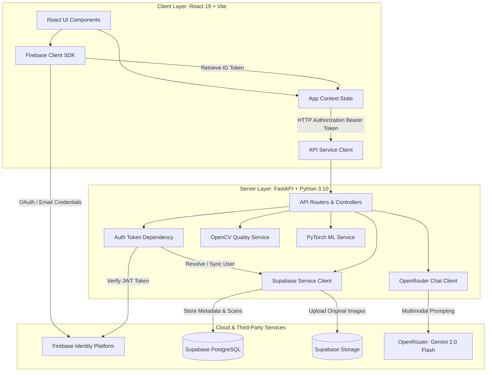

# 🩺 DermaScreen — System Architecture & Workflow Specification

This document provides a comprehensive technical overview of the **DermaScreen** system, including its high-level architecture, component relationships, data pipelines, authentication mechanisms, and external service integrations.

---

## 1. System Architecture

DermaScreen is structured as a decoupled client-server application powered by a React frontend, a FastAPI backend, and cloud-hosted data/auth services.

---

## 2. Key Components

### A. Frontend Application (React 19)
*   **App Core (`App.jsx` / `main.jsx`)**: Configures application routes using React Router DOM v7 and wraps the interface in the `AppContext` provider.
*   **State Management (`AppContext.jsx`)**: Manages session state, logged-in user profile, active scans, dashboard statistics, and real-time chat history.
*   **Firebase Authentication Client (`services/firebase.js`)**: Manages sign-up, sign-in (email/password and Google OAuth), password resets, and retrieves JSON Web Tokens (JWT) for secure backend requests.
*   **API Client (`services/api.js`)**: Employs an HTTP client to communicate with the FastAPI backend, automatically injecting the user's Firebase ID Token into the `Authorization: Bearer <token>` header of every request.

### B. Backend Application (FastAPI)
*   **Entry Point (`app/main.py`)**: Runs on Uvicorn, configures CORS middleware to allow cross-origin requests from defined frontend URLs, and exposes application routes.
*   **Lifespan Events (`app/main.py`)**: Preloads core resources on startup to minimize request latency:
    1.  Initializes the Firebase Admin SDK using service account credentials.
    2.  Loads image quality config/thresholds (`image_quality.pkl`).
    3.  Preloads the PyTorch ResNet50 classifier weights (`model.pth`) and model configuration parameters (`grad_cam.pkl`) into memory.
*   **Token Verification Dependency (`app/dependencies.py`)**: Intercepts request headers, decodes and validates Firebase JWT tokens, extracts the user ID/email, and registers or retrieves the corresponding user record from Supabase.
*   **Service Layer (`app/services/`)**:
    *   [quality_service.py](file:///c:/Users/Bhavesh%20Kaushik/Desktop/DermaScreen/backend/app/services/quality_service.py): Analyzes uploaded image files using OpenCV.
    *   [ml_service.py](file:///c:/Users/Bhavesh%20Kaushik/Desktop/DermaScreen/backend/app/services/ml_service.py): Preprocesses images, runs PyTorch classification, integrates the clinical ABCDE rule, and generates Grad-CAM visualizations.
    *   [supabase_service.py](file:///c:/Users/Bhavesh%20Kaushik/Desktop/DermaScreen/backend/app/services/supabase_service.py): Manages connections to Supabase PostgreSQL database and Storage buckets.
    *   [chat_service.py](file:///c:/Users/Bhavesh%20Kaushik/Desktop/DermaScreen/backend/app/services/chat_service.py): Sends structured conversational payloads (including text, history, and image assets) to OpenRouter.

---

## 3. Core Pipelines & Data Flows

### A. Skin Lesion Upload & AI Analysis Pipeline

The primary workflow processes user-uploaded skin scans through validation, storage, deep learning prediction, and database logging.

```mermaid
sequenceDiagram
    autonumber
    actor User as Patient/Clinician
    participant UI as React UI (Dashboard)
    participant API as FastAPI Backend
    participant Q as OpenCV Quality Service
    participant Supa as Supabase Cloud
    participant ML as PyTorch ResNet50
    participant FB as Firebase Admin SDK

    User->>UI: Upload Scan & Select ABCDE Questionnaire Answers
    UI->>API: POST /api/v1/predict (Multipart Form Data + JWT Token)
    
    critical Verify Authorization
        API->>FB: Verify Firebase ID Token
        FB-->>API: Token Valid (User ID, Email)
        API->>Supa: Fetch/Upsert User Metadata
    end
    
    rect rgb(25, 45, 65)
        note right of API: Step 1: Image Quality Assessment (OpenCV)
        API->>Q: analyze_image_quality(file_bytes)
        note right of Q: Check Resolution (min 224x224)<br/>Check Blur (Laplacian variance)<br/>Check Lighting (Mean brightness)<br/>Check Lesion Visibility (Canny contour edges)
        Q-->>API: Returns quality metrics & warning flags
    end

    rect rgb(35, 60, 45)
        note right of API: Step 2: Storage Persistence (Supabase Storage)
        API->>Supa: upload_image(file_bytes)
        Supa-->>API: Returns Public Image URL
    end

    rect rgb(55, 35, 55)
        note right of API: Step 3: ML Inference & ABCDE Fusion
        API->>ML: predict(image_bytes, abcde_answers)
        note right of ML: Normalize image & feed to ResNet50 model<br/>Calculate clinical ABCDE score (0-5)<br/>Combine ML suspicious probability with clinical score
        ML-->>API: Returns classification, confidence, risk tier, advice
    end

    rect rgb(55, 55, 35)
        note right of API: Step 4: Grad-CAM Visualization Generation
        API->>ML: _generate_gradcam(image_bytes)
        note right of ML: Computes gradients of target class output<br/>Extracts activations from layer4[-1] conv layer<br/>Blends jet color-mapped activations onto original image
        ML-->>API: Returns Base64-encoded PNG image string
    end

    API->>Supa: insert_scan(scan_record)
    API-->>UI: Returns JSON (Scan ID, Prediction, Confidence, Risk, Grad-CAM Base64, Image URL)
    UI-->>User: Render results dashboard with Grad-CAM visual insights
```

#### Detailed ML Prediction Logic & ABCDE Fusion
To ensure safety and clinical applicability, the ML prediction service (`ml_service.py`) dynamically combines the machine learning output with a clinical **ABCDE score** (Asymmetry, Border, Color, Diameter, Evolution) obtained from the user's checklist.
*   **ML Output**: The ResNet50 classifier computes a raw probability of suspicion (`suspicious_prob`).
*   **Clinical Score Calculation**: The system sums the number of positive selections in the 5-part ABCDE questionnaire.
*   **Probability Adjustment Rules**:
    *   **Score = 0**: Highly likely benign. Suspicion probability is reduced by **75%** (`susp_prob *= 0.25`).
    *   **Score = 1**: Minimally suspicious. Suspicion probability is reduced by **50%** (`susp_prob *= 0.50`).
    *   **Score = 2**: Borderline case. Suspicion probability is left unmodified.
    *   **Score = 3**: Concerning. Suspicion probability is guaranteed to be at least **60%** (`max(susp_prob, 0.60)`).
    *   **Score = 4**: Highly concerning. Suspicion probability is guaranteed to be at least **80%** (`max(susp_prob, 0.80)`), triggering a **High Risk** categorization.
    *   **Score = 5**: Critical. Suspicion probability is set to **95%**, triggering an **Urgent Evaluation Recommended** categorization.
*   **Risk Tiers Mapping**:
    *   `susp_prob <= 0.25`: **Low Risk** (Advice: *"Monitor for changes. No urgent action needed."*)
    *   `0.25 < susp_prob <= 0.50`: **Moderate Risk** (Advice: *"Consider a routine check-up with a doctor."*)
    *   `0.50 < susp_prob <= 0.75`: **High Risk** (Advice: *"See a dermatologist within the next few weeks."*)
    *   `0.75 < susp_prob <= 1.00`: **Urgent Evaluation Recommended** (Advice: *"Please see a dermatologist promptly."*)

---

## 4. Security & Authentication Architecture

DermaScreen maintains a zero-trust model between the frontend client and the backend services:

1.  **Token Issuance**: The client logs in through the Firebase Identity Platform. Firebase verifies credentials and generates a signed cryptographically-secure JSON Web Token (JWT).
2.  **Bearer Transmission**: All frontend calls to protected FastAPI routes must submit the JWT in an HTTP `Authorization` header (`Authorization: Bearer <JWT>`).
3.  **Backend Verification**:
    *   FastAPI intercepts the headers via its HTTPBearer middleware.
    *   The backend calls the Firebase Admin SDK to verify the token signature, issuer, and expiration date.
    *   A verified token guarantees the user's authenticity without exposing passwords to the backend server.
4.  **Database Tenant Isolation**:
    *   The verified Firebase User UID is matched against a Supabase user ID mapping (`users` table).
    *   All database queries filter by the resulting `user_id` to ensure users can only access their own scan histories, images, and chat logs.
